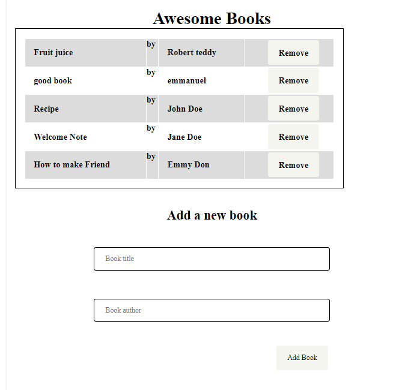

# Awesome Book

Awesome is a project that showcases my Javascript DOM manipulation experience and ability to the world!

If you like what you see and have a project you need coded, don't hesitate to contact me.

# Built With

- Major languages: HTML and CSS,
- Frameworks: N/A
- Technologies used: Web services

# Live Demo

[Live Demo Link](https://github.com/Emmy-github-webdev/book-awesome/tree/js-objects).

# Getting Started

To get a local copy up and running follow these simple example steps.

## Prerequisites 
- A working Laptop or Desktop
## Setup
- Install code editor
- Install Git bash
## Install
- clone the [project](https://github.com/Emmy-github-webdev/book-awesome/tree/js-objects).
## Usage
- Test your GitHub flow, a linter and professional documentation ability
## Run tests
- Open the project with code editor or double click the index.html file to run the project
## Deployment
- Push the project to your GitHub repo
- Navigate to page in the prject settings and publish
# Authors

- GitHub: [@githubhandle](https://github.com/Emmy-github-webdev).
- Twitter: [@twitterhandle](@ogaemmanueloga).
- LinkedIn: [Linkedin](https://github.com/Emmy-github-webdev/lint-test).

# Contributing

Contributions, issues, and feature requests are welcome!

Feel free to check the [issues page](https://github.com/Emmy-github-webdev/book-awesome/issues).

# Show your support

Give a :star: if you like this project!

